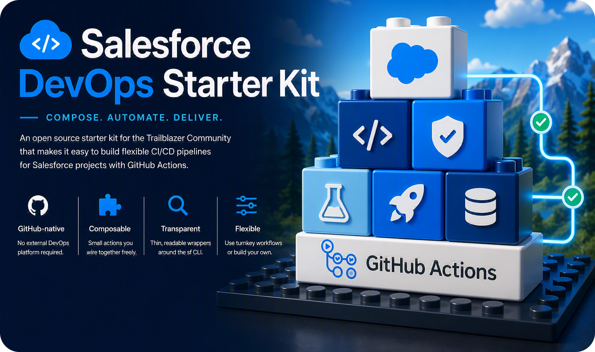
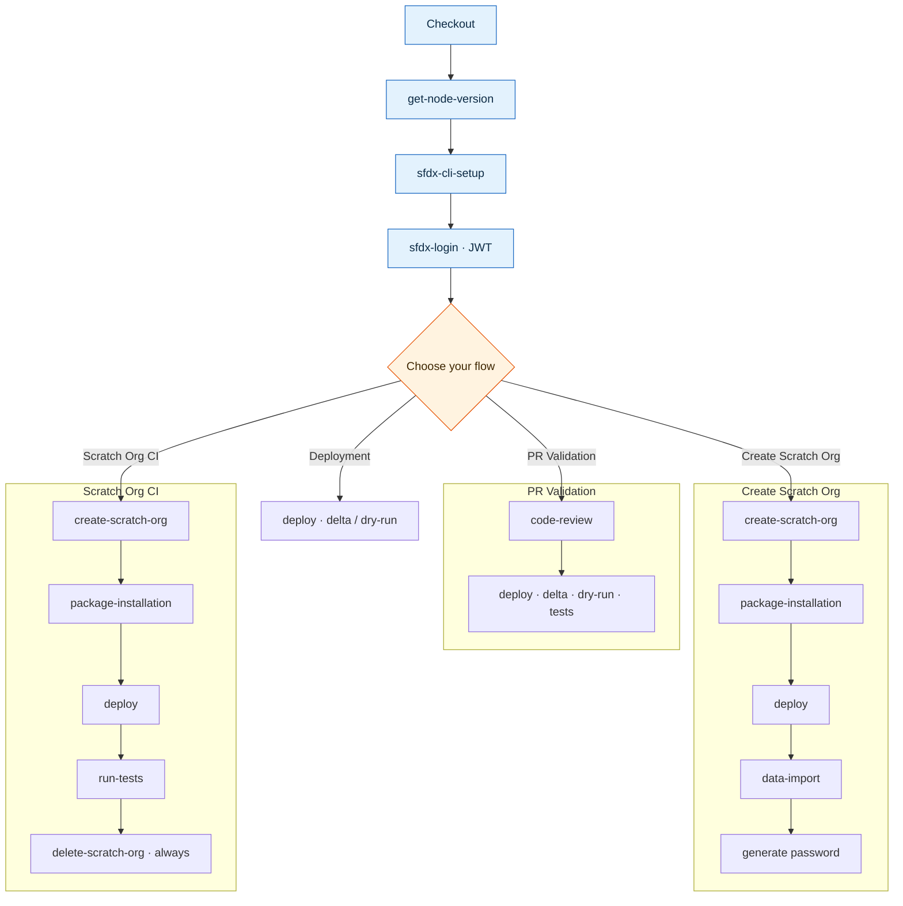

# ☁️ Salesforce DevOps Starter Kit



An open source starter kit for the Trailblazer Community that makes it easy to build flexible CI/CD pipelines for Salesforce projects with **GitHub Actions**.

The kit is built around a set of small, focused [GitHub Actions](#-building-blocks) that abstract away the complexity of the Salesforce CLI. Think of them as **building blocks**: each one does one job well, and you compose them into exactly the pipeline your project needs. On top of the building blocks, this repository provides ready-to-use [reusable workflows](#-reusable-workflows) and [copy-paste examples](#-examples) so you can get from zero to a working pipeline in minutes.

The full **[documentation site](https://svierk.github.io/salesforce-devops-starter-kit/)** is an auto-generated catalog of every building block and reusable workflow - each with its complete input/secret reference and copy-paste examples.

<a href="https://svierk.github.io/salesforce-devops-starter-kit/"></a>

## 🧱 Philosophy

- **GitHub-native** - no external DevOps platform required, just GitHub and GitHub Actions.
- **Composable** - small actions with clear inputs and outputs that you wire together freely.
- **Transparent** - every action is a thin, readable wrapper around the official `sf` CLI.
- **Flexible** - use the turnkey reusable workflows, or build your own pipeline from the blocks.

## 🧩 Building Blocks

Each building block lives in its own repository so it can be versioned and consumed independently.

| Action                                                                              | Purpose                                                            |
| ----------------------------------------------------------------------------------- | ------------------------------------------------------------------ |
| [🕵🏻 get-node-version](https://github.com/svierk/get-node-version)                   | Resolve and set up the Node.js version from `package.json`         |
| [⚙️ sfdx-cli-setup](https://github.com/svierk/sfdx-cli-setup)                       | Install the Salesforce CLI and related plugins                     |
| [🔐 sfdx-login](https://github.com/svierk/sfdx-login)                               | Authenticate to an org via SFDX Auth URL or JWT                    |
| [🌩️ sfdx-create-scratch-org](https://github.com/svierk/sfdx-create-scratch-org)     | Create a scratch org (outputs `username` / `org-id`)               |
| [🗑️ sfdx-delete-scratch-org](https://github.com/svierk/sfdx-delete-scratch-org)     | Delete a scratch org (cleanup)                                     |
| [🚀 sfdx-deploy](https://github.com/svierk/sfdx-deploy)                             | Deploy metadata, with delta and validation-only (dry-run) modes    |
| [✅ sfdx-run-tests](https://github.com/svierk/sfdx-run-tests)                       | Run Apex, LWC (Jest) and Flow tests with coverage reporting        |
| [🔎 sfdx-code-review](https://github.com/svierk/sfdx-code-review)                   | Static quality gate: Salesforce Code Analyzer, Prettier and ESLint |
| [📦 sfdx-package-installation](https://github.com/svierk/sfdx-package-installation) | Install (managed/unlocked) packages on a target org                |
| [💾 sfdx-data-import](https://github.com/svierk/sfdx-data-import)                   | Import records via Bulk API 2.0 (CSV) or sObject Tree (JSON)       |

## 🏗️ Architecture

The building blocks share a common foundation (checkout → setup → login) and then branch into the flow you need:



## 🚀 Quick Start

### Prerequisites

1. A Salesforce **Dev Hub** (for scratch org flows) and/or the target orgs you want to deploy to.
2. A CI integration user authenticated with the **JWT bearer flow** - the recommended, production-ready option used throughout this kit.
3. The credentials stored as **GitHub Actions secrets**: `SFDX_CONSUMER_KEY`, `SFDX_JWT_SECRET_KEY` and `SFDX_USERNAME`.

See [docs/authentication.md](docs/authentication.md) for a step-by-step JWT setup (and the simpler SFDX Auth URL alternative for local experiments).

### A minimal pipeline

```yaml
name: CI

on:
  pull_request:
    branches: [main]

jobs:
  validate:
    name: Validate
    runs-on: ubuntu-latest
    steps:
      - name: Checkout
        uses: actions/checkout@v7
        with:
          fetch-depth: 0 # full history so sfdx-deploy can derive delta/destructive changes

      - name: Install SF CLI
        uses: svierk/sfdx-cli-setup@main

      - name: Salesforce Org Login
        uses: svierk/sfdx-login@main
        with:
          client-id: ${{ secrets.SFDX_CONSUMER_KEY }}
          jwt-secret-key: ${{ secrets.SFDX_JWT_SECRET_KEY }}
          username: ${{ secrets.SFDX_USERNAME }}
          alias: ci

      - name: Validate Deployment
        uses: svierk/sfdx-deploy@main
        with:
          source-dir: force-app
          target-org: ci
          test-level: RunLocalTests
          dry-run: true
```

## 🔁 Reusable Workflows

For common scenarios you don't have to wire the blocks together yourself - call one of the maintained [reusable workflows](.github/workflows) instead:

| Workflow                                                           | Purpose                                                                                                     |
| ------------------------------------------------------------------ | ----------------------------------------------------------------------------------------------------------- |
| [pr-validation.yml](.github/workflows/pr-validation.yml)           | Validate a pull request: static analysis + check-only (delta) deployment with tests                         |
| [create-scratch-org.yml](.github/workflows/create-scratch-org.yml) | Self-service scratch org provisioning: create → install packages → deploy → import data → generate password |
| [scratch-org-ci.yml](.github/workflows/scratch-org-ci.yml)         | Full scratch org lifecycle for CI: create → deploy → test → delete                                          |
| [deployment.yml](.github/workflows/deployment.yml)                 | Deploy metadata to a sandbox or production org                                                              |

Call one from your own repository like this:

```yaml
jobs:
  pr-validation:
    uses: svierk/salesforce-devops-starter-kit/.github/workflows/pr-validation.yml@main
    with:
      source-dir: force-app
    secrets:
      SFDX_CONSUMER_KEY: ${{ secrets.SFDX_CONSUMER_KEY }}
      SFDX_JWT_SECRET_KEY: ${{ secrets.SFDX_JWT_SECRET_KEY }}
      SFDX_USERNAME: ${{ secrets.SFDX_USERNAME }}
```

## 📋 Examples

The [examples](examples) folder contains complete, copy-paste-ready caller workflows for each reusable workflow. Drop one into your project's `.github/workflows/` directory and adjust the inputs.

## 📚 Documentation

- 🌐 **[Documentation site](https://svierk.github.io/salesforce-devops-starter-kit/)** - the full building-block and workflow catalog, generated from this repository
- [docs/getting-started.md](docs/getting-started.md) - set up your first pipeline end to end
- [docs/authentication.md](docs/authentication.md) - configure SFDX Auth URL and JWT authentication

## 🏷️ Versioning recommendation

The examples in this kit reference the actions with `@main` for readability. In real pipelines this is also a **supply-chain risk**: a mutable ref runs whatever code is on that branch at run time - with access to your secrets - so a compromised or rewritten `@main` (of any action, including third-party ones like `actions/checkout`) would run unnoticed.

For production pipelines, **pin every action**:

- **Best - pin to a full-length commit SHA**, e.g. `svierk/sfdx-deploy@a1b2c3d…`. A SHA is immutable, so the code can never change under you. Tags (`@v1`) are convenient but can be re-pointed by the maintainer.
- **Good - pin to a released tag** (e.g. `svierk/sfdx-deploy@v1`) if you trust the publisher and prefer readability over immutability.
- Enable [Dependabot](https://docs.github.com/en/code-security/dependabot/working-with-dependabot/keeping-your-actions-up-to-date-with-dependabot) for `github-actions` so pinned SHAs/tags are bumped via reviewed pull requests instead of drifting silently.

This applies to **all** actions your workflows reference - the building blocks in this kit as well as `actions/*` and any other third-party action.

## 🤝 Contributing

Contributions are welcome! See [CONTRIBUTING.md](CONTRIBUTING.md) for how to propose changes, report issues, or add new building blocks.

## License

The scripts and documentation in this project are released under the [MIT License](LICENSE).
